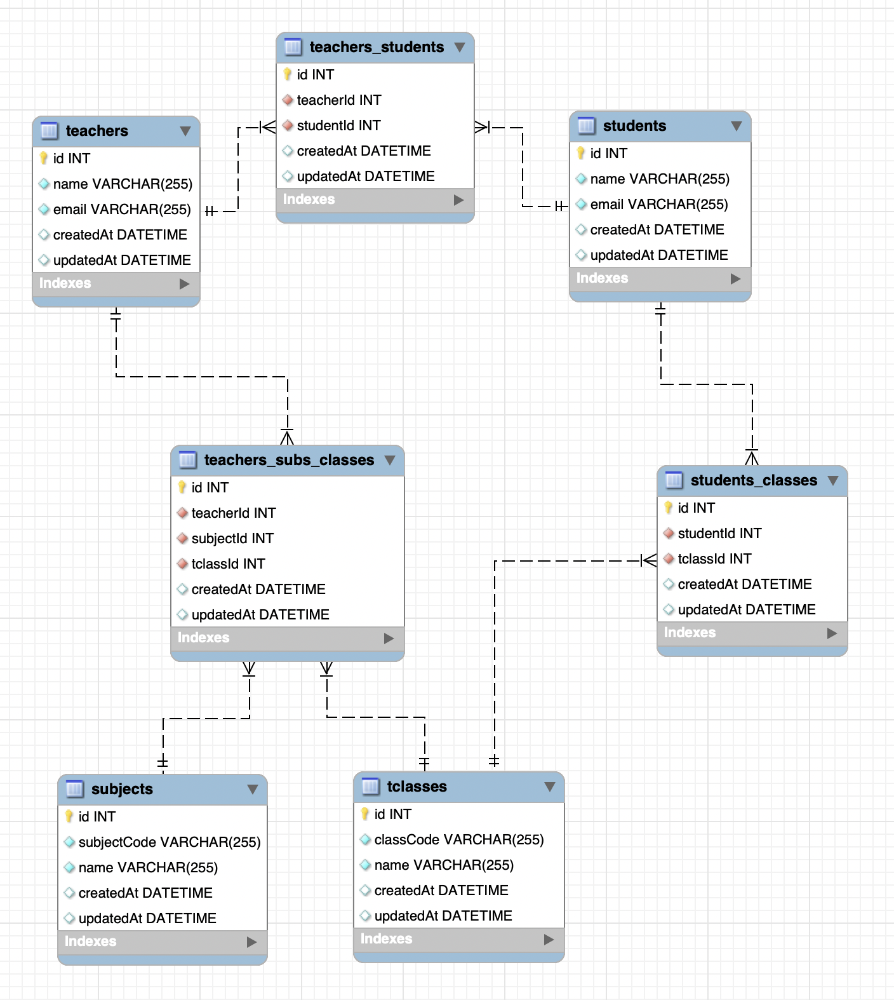

## School Administration System API

This API tool is inspired by the following User Stories which allows the School Administrator to carry out administrative tasks such as registration of teachers, students, classes and subjects, update of categorical information and the generation of report on all registered Teachers' workload.

## User Stories

> As an Administrator, I want to register Teachers, Students, Classes and Subject in a single API, so that I can use the system for administrative purposes.
>
> As an Administrator, I should be able to generate a report on a Teacher’s workload, so that I use it for planning.

## Development
#### Language
The application is written in Javascript.

#### Tech Stack
- **Environment**: Node.js, Docker
- **Web Application Framework**: Express.js
- **Database**: MySQL 8.0, mysql2 module, MySQL Workbench(GUI)
- **API Interaction**: Postman
- **Object-relational Mapping**: Sequelize
- **Unit-Testing**: Jest
- **Logger**: Winstonjs

## Features
- Register Teacher with his/her students in a particular class for a particular subject.
- Update any registered Teacher's, Student's, Class' or Subject's information.
- Generate a report of all registered Teachers with their subjects taken and the number of classes taught for each subject.


## Application Set-Up
#### Prerequisites

Prior to cloning, kindly ensure the following are present in your local machine.
1. [MySQL 8.0](https://dev.mysql.com/doc/refman/8.0/en/installing.html)
2. [MySQL Workbench](https://dev.mysql.com/downloads/workbench/)
3. [Docker](https://www.docker.com/get-started)
4. [Node.js 12.xx](https://nodejs.org/en/download/)
5. [Postman](https://www.postman.com/downloads/)

<br>

#### Installation

1. Git clone this repository in your desired local directory by running the following
```
git clone https://github.com/andicodetrf/school-admin.git
```

2. In the cloned directory, install all dependencies by running the following
```
npm install
```
<br>

#### Exposed Port

| S/N | Application | Exposed Port |
|-----|-------------|--------------|
| 1   | database    | 33306        |
| 2   | application | 3000         |

<br>

#### Database Connection
1. Create a .env file in the same directory as the .env.sample file
2. Copy the contents of .env.sample file into your created .env file
3. Replace the mysql password *'yourmysqlpassword'* in the following files with your local machine's mysql root user's *password*

Files to configure:
```
/.env
/docker-compose.yml
/config/config.js
/src/config/database.js
```

4. In MySQL Workbench, create a new connection with the following details
  - Hostname: 127.0.0.1
  - Port: 33306
  - Username: root

<br>

#### Initialize Database
1. Run the following to create a Docker container for the MySQL Database
  - *Running this command for the first time sets up the container for the database in your local machine*
  - *Subsequent executions of this command will only start the server*
```
npm start
```
2. Open the created MySQL Workbench connection and enter your password. On success, the server would log the following:
```
2020-10-15 11:13:36     [database.js]   INFO    Executing (default): SELECT 1+1 AS result
2020-10-15 11:13:36     [server.js]     INFO    Application started at http://localhost:3000
```
<br>

#### Migration & Seeding
1. If the server is running, stop the server and run the following to create the Database Schema
```
sequelize db:migrate
```
2. For quick data population, run the following to seed data into Database Tables
```
sequelize db:seed:all
```

<br>

#### Database Entity Relationship Diagram

The Database Schema Design is based on the following assumptions:
1. A teacher can teach in multiple classes.
2. A teacher can teach multiple subjects, regardless to the same or different class.
3. 2 different teachers can teach the same subject in the same class.
4. A student can be in multiple classes.




## API Routes:

### Summary
Postman is used for performing the following API interactions.

**Host**: localhost
<br>

**Port**: 3000

```
http://localhost:3000[URL Endpoint]
```

| Request Method | URL Endpoint             | Features                                                            |
| -------------- | ------------------------ | ------------------------------------------------------------------------- |
| POST           | /api/register            | Register Teacher with Students, Subject and Class                         |
| POST           | /api/register/update     | Update registered Teacher's, Student's, Subject's or Class' Information  |
| GET            | /api/reports/workload    | Generate report on all registered Teachers and their workload             |


<br>

### 1. Register Teacher with Students, Subject and Class

Registers Teacher and his/her students for a particular subject in a particular class

**Request Body Example:**

```
{
  "teacher": {
    "name": "Mr. Teacher 1",
    "email": "teacherone@gmail.com"
  },
  "students": [
            {
              "name" : "John",
              "email" : "John@gmail.com"
            },
            {
              "name" : "Jane",
              "email" : "Jane@gmail.com"
            }
  ],
  "subject": {
    "subjectCode": "ENG",
    "name": "English"
  },
  "class": {
    "classCode": "P1-I",
    "name": "P1 Integrity"
  }
}
```

**Response Example**

Status Code: **204**

<br>

### 2. Update registered Teacher's, Student's, Subject's or Class' Information

Updates either Teacher's, Student's, Subject's or Class' information with one request at a time using the following registered unique fields:

- Teacher: Existing email
- Student: Existing email
- Subject: Existing subject code
- Class: Existing class code

**Request Body Examples:**

*Teacher*
```
{
  "teacher": {
      "email": "teacherone@gmail.com",
      "updateName": "Mr. Smith",
      "updateEmail": "smith@gmail.com"
  }
}
```
*Student*
```
{
  "student": {
      "email": "john@gmail.com",
      "updateName": "John Doe",
      "updateEmail": "johndoe@gmail.com"
  }
}
```
*Subject*
```
{
 "subject": {
        "subjectCode": "ENG",
        "updateName": "English1",
        "updateSubjectCode": "ENG1"
  }
}
```
*Class*
```
{
 "class": {
        "classCode": "P1-I",
        "updateName": "P1 Unity",
        "updateSubjectCode": "P1-U"
  }
}
```

**Response Body Example:**
*Response for Teacher or Student update:*
```
{
    "status": 200,
    "message": "Person details updated"
}
```
*Response for Subject update:*
```
{
    "status": 200,
    "message": "Subject details updated"
}
```
*Response for Class update:*
```
{
    "status": 200,
    "message": "Class details updated"
}
```

<br>

### 3. Generate report on all registered Teachers and their workload

Generates in JSON format the list of registered teachers, their subjects taken and the number of classes taught for each subject.

**Response Body Example:**

```
{
    "status": 200,
    "report": {
        "peter tan": [
            {
                "subjectCode": "ENG",
                "subjectName": "English",
                "numberOfClasses": 1
            }
        ],
        "mr. smith": [
            {
                "subjectCode": "ENG",
                "subjectName": "English",
                "numberOfClasses": 2
            },
            {
                "subjectCode": "MATH",
                "subjectName": "Mathematics",
                "numberOfClasses": 1
            }
        ]
    }
}
```

## Unit Testing (In Progress)

<!-- ```
npm test
``` -->

## Contributor

1. Andrea Lau : [andrea_lau92@hotmail.com](mailto:andrea_lau92@hotmail.com)
